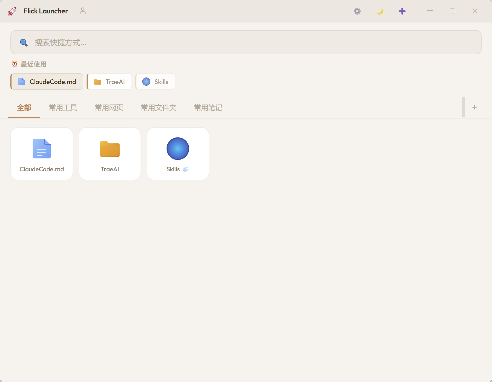

# 🚀 Flick Launcher - 桌面快速启动器

一个轻量级的 Windows 桌面快速启动工具，让你告别在文件夹中翻找的烦恼。


## ✨ 功能特性

- 🚀 **快速启动** — 一键启动常用程序、文件和网页
- 🌐 **网页快捷方式** — 支持添加 URL，快速打开常用网站
- 📁 **分类管理** — 4 个默认分类（常用工具 / 常用网页 / 常用文件夹 / 常用笔记），支持自定义
- 🔍 **搜索过滤** — 实时搜索，快速定位
- 🖱️ **拖拽排序** — 自由调整快捷方式顺序
- 🎨 **内置图标库** — 18 个精美渐变色 SVG 图标，也可自动提取 .exe 图标或自定义
- 📂 **自定义数据路径** — 支持更改数据存储位置，并可一键迁移已有数据
- 📦 **导入/导出** — 一键备份和恢复配置
- 🔄 **开机自启** — 可选开机自动运行
- ⌨️ **全局快捷键** — 按快捷键随时唤出
- 📊 **最近使用** — 温度衰减式展示最近启动的程序
- 🌙 **主题切换** — 亮色 / 暗色主题
- 🪟 **精致窗口控制** — SVG 矢量图标，最大化自动切换还原图标
- 🔄 **自动更新** — 支持在线检测和下载更新，无需手动下载

## 📸 界面预览



## 🛠️ 安装运行

### 前提条件

- [Node.js](https://nodejs.org/) >= 18
- [pnpm](https://pnpm.io/) >= 8

### 步骤

1. **克隆项目**
   ```bash
   git clone https://github.com/Augenstern-creator/FlickLauncher.git
   cd FlickLauncher
   ```

2. **安装依赖**
   ```bash
   pnpm install
   ```
> [解决 Electron 安装失败问题](https://juejin.cn/post/7511036916898398246)

3. **开发模式运行**
   ```bash
   pnpm start
   ```

4. **打包为 Windows 安装包**
   ```bash
   pnpm build
   ```
   打包完成后，安装包在 `build/` 目录下。

   > ⚠️ **Windows 11 智能应用控制提示**
   >
   > 打包后的 `.exe` 文件可能被 Windows 11 的"智能应用控制"（Smart App Control）拦截，
   > 因为项目未购买代码签名证书（OV/EV 证书年费约 $200-$400）。
   >
   > **推荐方案：**
   > - 直接使用 `pnpm start` 以开发模式运行，无需打包，不会被拦截
   > - 如必须使用打包版本，安装时点击"更多信息" → "仍要运行"即可
   > - 本项目已申请开源免费签名证书，待审核通过后将提供签名版本

### 发布更新

1. 更新 `package.json` 中的 `version` 字段
2. 在 `changelog.json` 中添加新版本的更新日志
3. 构建安装包：`pnpm build`
4. 在 GitHub 上创建新的 Release：
   - 访问 https://github.com/Augenstern-creator/FlickLauncher/releases
   - 点击 "Draft a new release"
   - Tag version 填写 `v1.2.0`（与 package.json 中的版本一致）
   - 上传 `build/` 目录下的 `.exe` 和 `.yml` 文件
   - 发布 Release
5. 用户下次启动应用时会自动检测到更新

## 📖 使用指南

### 添加快捷方式

1. 点击右上角 ➕ 按钮
2. 选择类型：
   - **文件/文件夹** — 点击「选文件」或「选文件夹」按钮选择本地路径
   - **网页 URL** — 输入 `http://` 或 `https://` 开头的网址
3. 输入名称（文件会自动填充，URL 会提取域名）
4. 选择分类
5. 选择图标：
   - 从 **18 个内置图标** 中挑选
   - 或点击「浏览」选择自定义图标文件（`.ico` `.png` `.jpg`）
   - `.exe` 文件会自动提取图标
6. 点击「添加」

### 启动程序

- **单击** 快捷方式图标即可启动
- 也可以在「最近使用」区域快速启动

### 管理快捷方式

- **右键** 快捷方式图标 → 打开右键菜单
  - 启动 / 编辑名称 / 更换图标 / 移动分类 / 删除
- **拖拽** 快捷方式图标可以调整顺序

### 分类管理

- 点击分类标签切换显示
- 点击 `+` 创建新分类
- **右键** 分类标签 → 重命名 / 删除

### 设置

- 点击 ⚙️ 打开设置面板
- **主题**: 切换亮色 / 暗色主题
- **开机自启**: 设置是否开机自动运行
- **全局快捷键**: 选择快捷键组合，按下即可唤出/隐藏启动器
- **数据存储位置**: 更改配置文件存放路径，支持一键迁移已有数据（推荐路径：`E:\HappySoftCache\flick-launcher`）
- **导入/导出**: 备份和恢复配置
- **软件更新**: 检查更新和查看更新日志

### 自动更新

应用支持在线自动更新：
- 启动时自动检查更新（静默）
- 发现新版本时会弹窗提示
- 支持下载和安装更新
- 更新日志在启动时自动显示（仅新版本）

开发者可通过修改 `changelog.json` 文件管理更新日志内容。

## ⌨️ 快捷键

| 快捷键 | 功能 |
|--------|------|
| `Ctrl+Shift+Space` | 显示/隐藏启动器（默认，可在设置中修改） |
| `Ctrl+Shift+L` | 备选快捷键 |
| `Ctrl+Alt+Q` | 备选快捷键 |
| `Ctrl+Alt+Space` | 备选快捷键 |
| `Ctrl+F` | 聚焦搜索框 |
| `ESC` | 关闭弹窗 |
| 右键快捷方式 | 上下文菜单（启动/编辑/移动/删除） |
| 右键分类标签 | 重命名/删除分类 |
| 拖拽快捷方式 | 调整排列顺序 |

## 📦 数据存储

配置文件默认存储在：
```
%APPDATA%/flick-launcher/flick-launcher-config.json
```

推荐路径：`E:\HappySoftCache\flick-launcher`

你可以在设置中更改数据存储位置，已有数据支持一键迁移。

## 🏗️ 技术栈

- **[Electron](https://www.electronjs.org/)** — 桌面应用框架
- **HTML / CSS / JS** — 原生前端（零框架依赖）
- **[electron-store](https://github.com/sindresorhus/electron-store)** — JSON Schema 配置持久化
- **[electron-builder](https://www.electron.build/)** — Windows NSIS 打包

## 📁 项目结构

```
FlickLauncher/
├── main.js                # Electron 主进程入口
├── preload.js             # 预加载脚本（安全 IPC 桥接）
├── src/
│   ├── store.js           # 数据存储管理（electron-store）
│   ├── launcher.js        # 程序/URL 启动逻辑
│   ├── iconExtractor.js   # .exe 图标提取（PowerShell）
│   ├── autoStart.js       # 开机自启管理
│   ├── globalShortcut.js  # 全局快捷键注册
│   └── tray.js            # 系统托盘管理
├── renderer/
│   ├── index.html         # 主界面
│   ├── styles.css         # 样式（亮/暗主题变量）
│   ├── renderer.js        # 交互逻辑
│   └── icons/
│       ├── default-icon.png       # 默认图标
│       └── builtin/               # 18 个内置 SVG 图标
│           ├── globe.svg          # 浏览器
│           ├── mail.svg           # 邮件
│           ├── folder.svg         # 文件夹
│           ├── file.svg           # 文件
│           ├── code.svg           # 代码
│           ├── music.svg          # 音乐
│           ├── video.svg          # 视频
│           ├── image.svg          # 图片
│           ├── gear.svg           # 设置
│           ├── terminal.svg       # 终端
│           ├── game.svg           # 游戏
│           ├── chat.svg           # 聊天
│           ├── cloud.svg          # 云
│           ├── document.svg       # 文档
│           ├── calendar.svg       # 日历
│           ├── shopping.svg       # 购物
│           ├── wrench.svg         # 工具
│           └── star.svg           # 收藏
└── package.json           # 项目配置
```

## 🤝 贡献

欢迎提交 Issue 和 Pull Request！

## 📄 License

MIT
